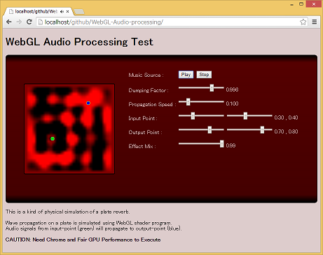

WebGL-Audio-processing
======================

audio processing sample with WebGL shader program

### Description
This is a kind of physical simulation of a plate reverb.
Wave propagation on a plate is simulated using WebGL shader program.

Audio signals from input-point (green) will propagate to output-point (blue).

### Demo
  [Live Demo Page](http://g200kg.github.io/WebGL-Audio-processing/)

### Caution
  Need Chrome and Fair GPU Performance to Execute.
  Otherwise, the browser may be hunged.

